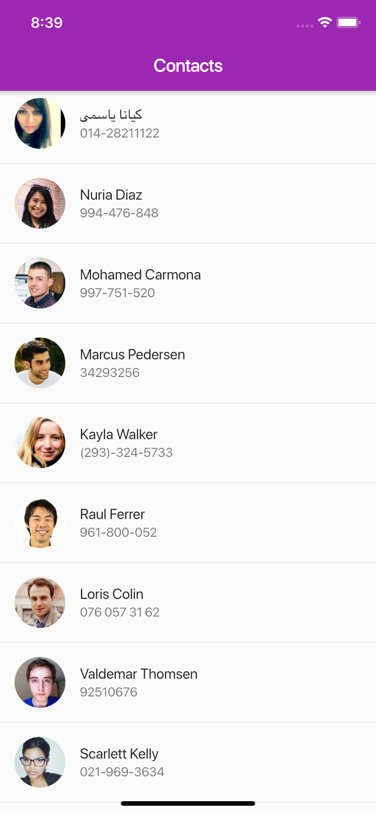
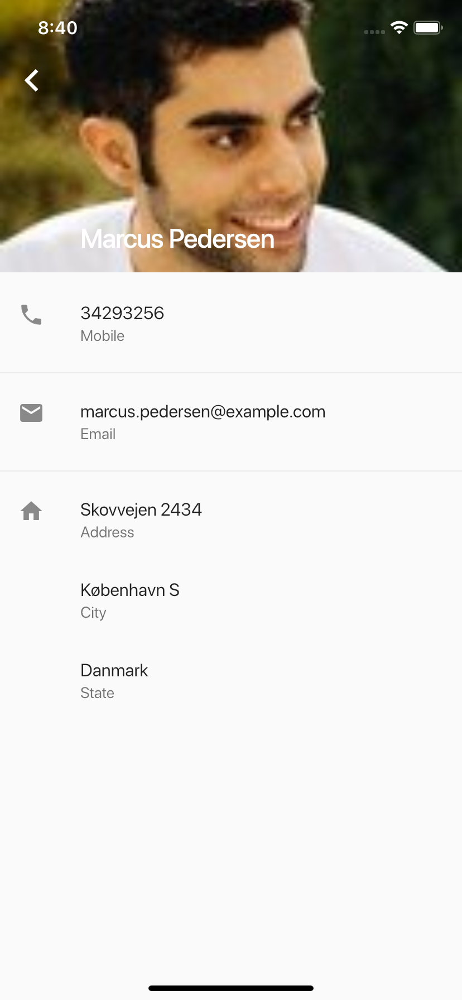

# contacts

A simple Flutter project to learn about FutureBuilder, Routes with names and Hero widget. The contacts list is recovered with http package from https://randomuser.me.

## Getting Started

