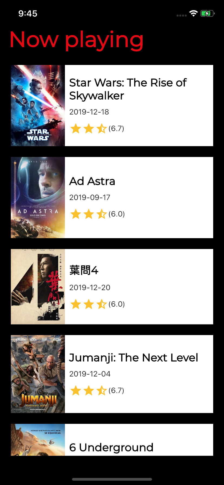

# movies_list

A simple Flutter project with a now playing movies list from Themoviesdb.org. This project contains:

* Google fonts usage
* http library to get the movies
* Theme
* Pull to refresh with RefreshIndicator widget
* Infinite scroll list with ListView.builder

